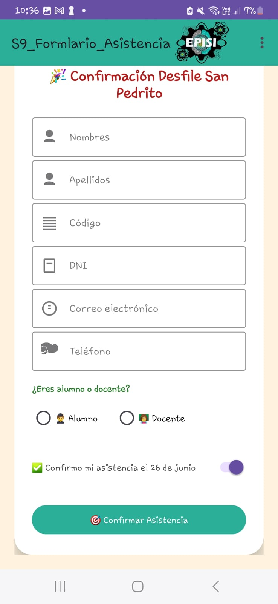
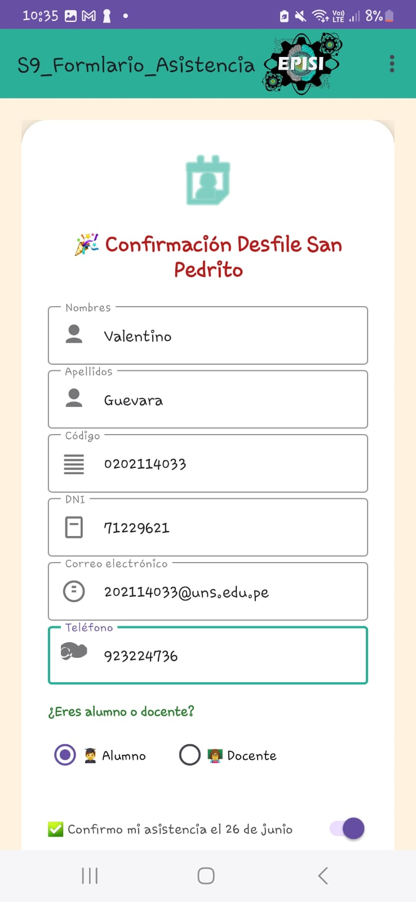
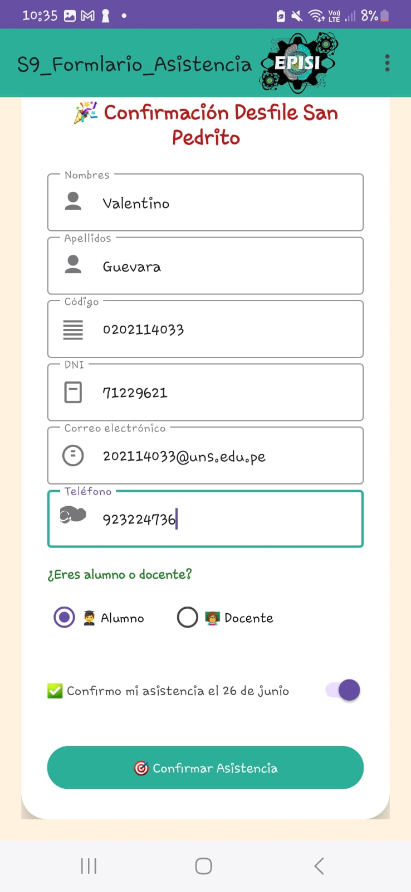
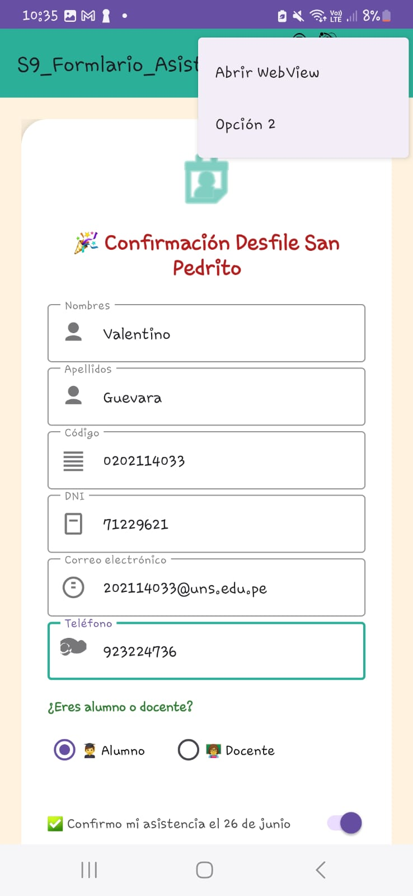
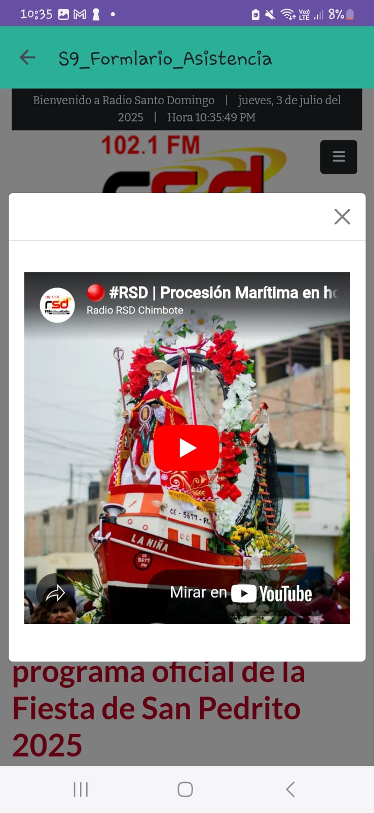
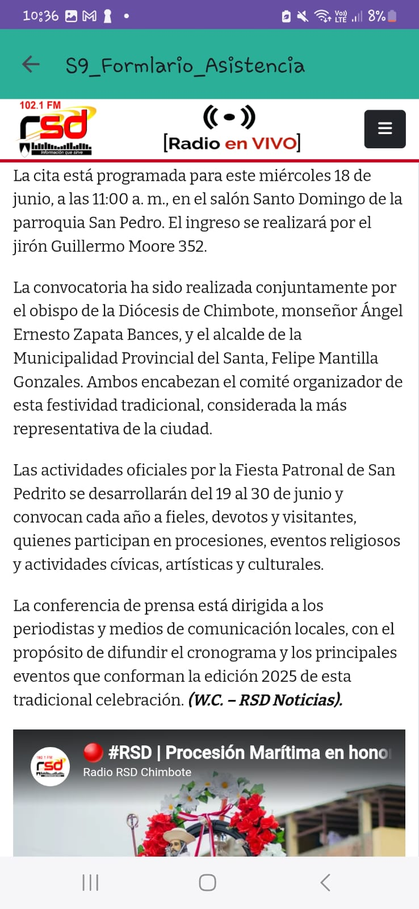
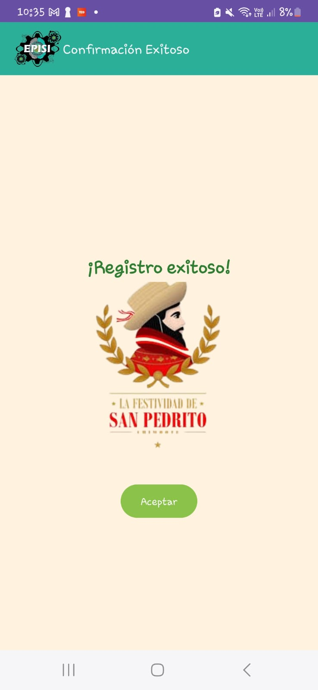

# 🪷 Confirmación Desfile San Pedrito - EPISI UNS

**Desarrollado por:** Valentino Guevara  
**Correo:** [202114033@uns.edu.pe](mailto:202114033@uns.edu.pe)  
**GitHub:** [ValentinoGuevara](https://github.com/ValentinoGuevara)  
**Curso:** Aplicaciones Móviles – Semana 7 y 8  

  

---

## 📋 Descripción General

Aplicación Android desarrollada en Kotlin para registrar la asistencia de estudiantes y docentes al **Desfile de San Pedrito 2025**, organizado por la **Escuela Profesional de Ingeniería de Sistemas e Informática (EPISI)** de la **Universidad Nacional del Santa**.

La app incluye un formulario con campos validados, selección de tipo de usuario, y navegación hacia un **WebView** informativo sobre la festividad tradicional de San Pedrito en Chimbote.

---

## 🛠️ Tecnologías Utilizadas

| Tecnología         | Propósito                                    |
|--------------------|----------------------------------------------|
| Kotlin             | Lenguaje de programación principal           |
| Android Studio     | Entorno de desarrollo                       |
| Material Design    | Componentes modernos y adaptativos           |
| WebView            | Visualización de contenido externo (web)     |
| Drawable Resources | Personalización con íconos e imágenes        |

---

## ✨ Funcionalidades

- Registro de datos: nombres, apellidos, código, DNI, teléfono y correo.
- Selección de **tipo de usuario**: Alumno o Docente.
- Switch para **confirmar asistencia**.
- **Menú de navegación** para acceder al formulario o a la web de San Pedrito.
- Visualización de la **página oficial** de la festividad a través de WebView.
- Diseño atractivo con Material Design.

---

## 📱 Capturas de Pantalla

  <table>
    <tr>
      <td></td>
      <td></td>
      <td></td>
    </tr>
    <tr>
      <td></td>
      <td></td>
      <td></td>
    </tr>
    <tr>
      <td></td>
      <td></td>
    </tr>
  </table>
  
Capturas reales del formulario y navegación web en acción

---

## 🧭 Cómo Usar la App

1. Abre la aplicación.
2. Completa tus datos personales en el formulario.
3. Selecciona si eres **Alumno** o **Docente**.
4. Activa el switch de asistencia para confirmar tu participación.
5. Pulsa el botón **Confirmar Asistencia**.
6. Accede al menú y visita la sección **Fiesta San Pedrito**.
7. Visualiza la información cultural directamente en el WebView.

---

## 🏗️ Estructura del Proyecto

FormularioSanPedrito/
├── java/com/example/formulariosanpedrito/
│ ├── MainActivity.kt
│ ├── WebViewActivity.kt
│ └── MenuActivity.kt
├── res/
│ ├── layout/
│ │ ├── activity_main.xml
│ │ ├── activity_webview.xml
│ │ └── activity_menu.xml
│ ├── drawable/
│ │ ├── ic_sanpedrito.xml
│ │ └── fondo_banner.jpg
│ └── values/
│ ├── colors.xml
│ ├── strings.xml
│ └── themes.xml
├── AndroidManifest.xml
└── README.md

yaml
Copiar
Editar

---

## 🔮 Mejoras Futuras

- Validación automática de campos vacíos.
- Confirmación por Snackbar.
- Conexión a Firebase para guardar confirmaciones.
- Exportación de lista de asistentes a Excel/PDF.
- Adaptación al modo oscuro.

---

## 📚 Licencia

© 2025 - Valentino Guevara
Prohibido el uso comercial sin autorización expresa.

php-template
Copiar
Editar

---

  
  
¡Explora el código y contribuye!

  

